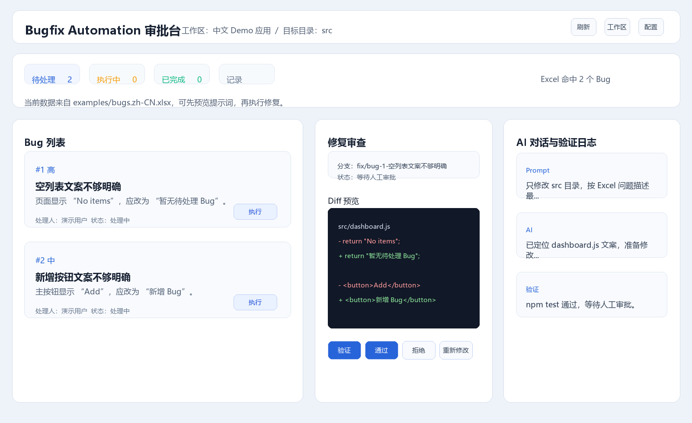
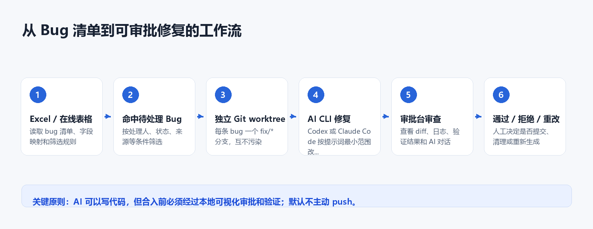
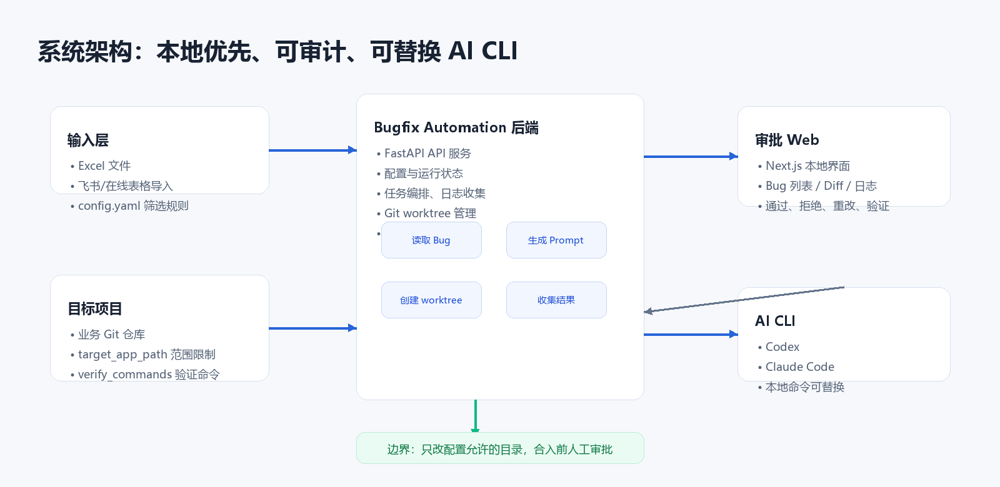

# Bugfix Automation 中文使用说明手册

版本：P0 中文 Demo 版

适用对象：研发负责人、前端/全栈开发、研发效能团队、内部工具团队。

## 1. 产品定位

Bugfix Automation 是一个本地优先的 AI Bug 修复编排与审批平台。它不是 AI IDE，也不会主动 push 代码。它负责把 Excel 或在线表格里的 bug 清单转成隔离的 AI 编码任务，让 Codex 或 Claude Code 在独立 Git worktree 中尝试修复，并把结果交给开发者在本地审批台中审查、验证、重改、通过或拒绝。

一句话定位：

本地优先的 AI Bug 修复编排与审批平台。



核心价值：

- 批量读取 bug 清单。
- 每条 bug 独立 worktree 和独立分支。
- 调用 Codex 或 Claude Code 自动尝试修复。
- 人工审批 diff、日志和验证结果。
- 不主动 push，保证代码进入主分支前可控、可审计。

## 2. 当前默认 Demo

当前默认是中文 Demo 配置：

- 配置文件：`config.yaml`
- 中文模板：`config.example.yaml`
- 英文模板：`config.example.en.yaml`
- 中文示例 Excel：`examples/bugs.zh-CN.xlsx`
- 英文示例 Excel：`examples/bugs.en.xlsx`
- Demo 目标仓库：`examples/demo-target-repo`

Demo 里有两条会被筛选出来的中文 bug：

1. 空列表文案不够明确
2. 新增按钮文案不够明确

另外还有两条用于演示筛选规则的数据，不会进入待处理队列。

## 3. 快速开始

进入项目目录：

```powershell
cd C:\Users\user\Downloads\skill2\skills\bugfix-automation
```

安装依赖：

```powershell
python -m pip install -r requirements.txt
Push-Location approval-web
npm install
Pop-Location
```

初始化中文 Demo：

```powershell
python -m bugfix_automation.cli init --locale zh-CN --reset-config --reset-runtime
```

启动审批台：

```powershell
python -m bugfix_automation.cli approval-server
```

打开浏览器：

```text
http://127.0.0.1:8765
```



## 4. 环境检查

运行：

```powershell
python -m bugfix_automation.cli doctor
```

你应该看到：

- Python OK
- Git OK
- Node OK
- npm OK
- config OK
- excel OK
- target_repo OK
- target_app_path OK

如果 Codex 或 Claude 是 WARN，说明本机暂时没有配置对应 AI CLI。dry-run 不受影响，真实 AI 修复需要至少配置一个可用 AI CLI。

## 5. 查看命中的 Bug

运行：

```powershell
python -m bugfix_automation.cli list
```

它会读取 `examples/bugs.zh-CN.xlsx`，根据 `config.yaml` 中的筛选规则选出当前处理人需要处理的 bug。

默认筛选规则是：

- `处理人` 等于 `演示用户`
- `处理状态` 不在 `已处理, 已关闭`
- `提出人状态` 在 `待处理, 处理中`

## 6. Dry-run 演练

演练全部命中的 bug，不调用 AI：

```powershell
python -m bugfix_automation.cli list --dry-run
```

演练单条 bug：

```powershell
python -m bugfix_automation.cli run-one --row 2 --dry-run
```

dry-run 会生成报告：

- `runs/YYYY-MM-DD/report.json`
- `runs/YYYY-MM-DD/report.md`
- `runs/YYYY-MM-DD/approval.md`

## 7. 真实调用 AI 修复

前提：本机 `codex` 或 `claude` 命令可用。

修复 Excel 第 2 行 bug：

```powershell
python -m bugfix_automation.cli run-one --row 2
```

系统会执行：

1. 读取 bug 信息。
2. 生成 `fix/*` 分支名。
3. 在 demo 目标仓库创建独立 worktree。
4. 生成修复 prompt。
5. 调用 Codex 或 Claude Code。
6. 收集 diff 和日志。
7. 在审批台展示待审批结果。

## 8. 审批台使用说明

审批台地址：

```text
http://127.0.0.1:8765
```


主要区域：

- Bug 列表：显示当前 Excel 命中的 bug。
- 待审批分支：显示 AI 已经生成的 `fix/*` 分支。
- Diff 面板：查看 AI 修改了哪些文件。
- 日志面板：查看 Codex 或 Claude Code 执行日志。
- 配置面板：调整 Excel、筛选规则、工作区、提示词、AI CLI 和并发数。
- 验证面板：运行配置的验证命令，例如 `npm test`。
- 操作按钮：通过、拒绝、清理、重新修改、提交验证结果。

推荐操作顺序：

1. 先看 Bug 列表确认筛选结果。
2. 对某条 bug 执行 dry-run 或真实 run-one。
3. 在待审批分支里选择 AI 生成的修复。
4. 查看 diff 和日志。
5. 运行验证。
6. 如果结果可接受，点击通过或提交。
7. 如果不满意，使用重新修改或拒绝。

## 9. 接入自己的项目

修改 `config.yaml`：

```yaml
excel_path: D:/bugs/今日问题.xlsx
sheet_name: Bug清单
assignee: 张三

target_repo: D:/code/my-web
target_app_path: src
```

然后检查：

```powershell
python -m bugfix_automation.cli doctor
python -m bugfix_automation.cli list
```

如果能看到命中的 bug，就可以继续 dry-run 或真实运行。

## 10. Excel 字段映射

如果你的 Excel 字段名和 Demo 不一样，需要修改 `excel_profile.canonical_fields`：

```yaml
excel_profile:
  canonical_fields:
    issue_id: 序号
    assignee: 处理人
    assignee_status: 处理状态
    description: 问题描述
    remark: 备注
```

常用字段：

- `issue_id`：bug 编号。
- `description`：问题描述。
- `assignee`：处理人。
- `assignee_status`：处理状态。
- `requester_status`：提出人状态。
- `source_system`：来源系统。
- `remark`：备注。
- `remark2`：备注2。

## 11. 筛选规则

筛选规则在 `filters` 中：

```yaml
filters:
  - field: 处理人
    op: equals
    value: 张三
  - field: 处理状态
    op: not_in
    values: 已处理,已关闭
```

支持的操作：

- `equals`
- `not_equals`
- `in`
- `not_in`
- `non_empty`
- `empty`

## 12. 工作区配置

`workspaces` 用于配置一个或多个目标项目：

```yaml
workspaces:
  - id: web
    name: Web 前端
    target_repo: D:/code/my-web
    target_app_path: src
    scope_paths: src
    verify_commands: npm test,npm run build
    prompt_context_paths: src
    max_concurrency: 2
```

重要字段：

- `target_repo`：目标 Git 仓库路径。
- `target_app_path`：允许 AI 修改的目录。
- `verify_commands`：审批前可运行的验证命令。
- `prompt_context_paths`：加入 prompt 的上下文路径。
- `max_concurrency`：并发处理数量。

## 13. AI CLI 配置

默认：

```yaml
cli_tool: codex
```

也可以配置 Claude：

```yaml
cli_tool: claude
```

或使用绝对路径：

```yaml
cli_tool: C:/Users/user/AppData/Roaming/npm/codex.cmd
```

检查命令：

```powershell
python -m bugfix_automation.cli doctor
```

## 14. 安全边界

项目默认遵守这些安全边界：

- 不主动 push。
- 每条 bug 一个独立 worktree。
- AI 运行时注入本地 Git wrapper，阻止 `git push`。
- 只检查并审批 `target_app_path` 范围内的改动。
- `logs/`、`runs/`、`uploads/`、`.target-worktrees/`、`data/app.sqlite3` 不提交到 Git。
- 最终是否通过、重改、拒绝由开发者决定。

## 15. 常见问题

### 1. 页面打不开

确认服务是否启动：

```powershell
python -m bugfix_automation.cli approval-server
```

默认端口：

- 前端：`8765`
- 后端 API：`8766`

### 2. doctor 里 Codex / Claude 是 WARN

说明 AI CLI 不可用。你仍然可以 dry-run，但真实修复需要安装或配置 AI CLI。

### 3. list 没有 bug

检查：

- Excel 路径是否正确。
- sheet_name 是否正确。
- 字段映射是否正确。
- filters 是否过严。
- 处理人字段是否匹配。

### 4. Windows 下中文终端乱码

这通常是 PowerShell 输出编码问题。文件和浏览器页面使用 UTF-8，浏览器显示一般正常。

### 5. npm test 失败

Demo 目标仓库故意有两个失败测试，用来让 AI 修复。真实项目里，测试失败需要看日志判断是代码问题还是环境问题。

## 16. 建议使用流程



第一次使用：

```powershell
python -m bugfix_automation.cli init --locale zh-CN --reset-config --reset-runtime
python -m bugfix_automation.cli doctor
python -m bugfix_automation.cli list
python -m bugfix_automation.cli run-one --row 2 --dry-run
python -m bugfix_automation.cli approval-server
```

接入真实项目：

1. 修改 `config.yaml`。
2. 配置自己的 Excel。
3. 配置自己的目标仓库。
4. 配置 `target_app_path`。
5. 运行 `doctor`。
6. 运行 `list` 检查筛选结果。
7. 先 dry-run。
8. 再真实调用 AI。
9. 在审批台审查 diff 和日志。
10. 验证通过后提交。
